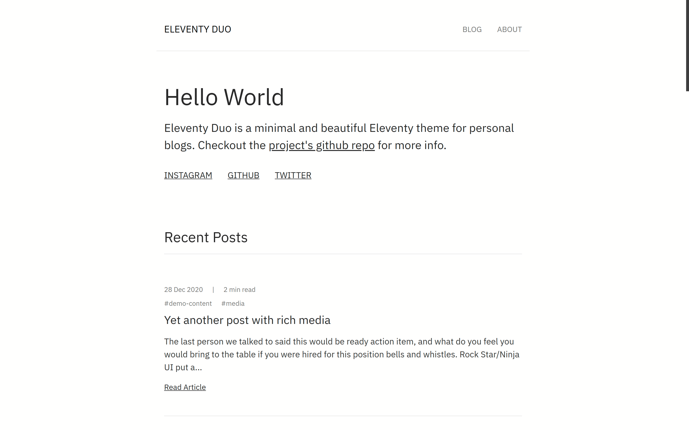

# Walk The Camino blog

My travel blog based on the Eleventy Duo theme, a minimal and beautiful Eleventy theme for personal blogs.

## [Live demo of theme](https://eleventyduo.netlify.app)

## [GitHub Repo of theme](https://github.com/yinkakun/eleventy-duo)

Big thanks to the developer [Yinkakun](https://github.com/yinkakun/) for developing this theme to be used for personal blogs. Check out their work at [yinkakun.vercel.app](https://yinkakun.vercel.app/). 

## Issues

On the first run of `yarn dev` an error is thrown up in the file `node_modules/postcss/package.json`. To fix this at line 14 I replaced 

`"./": "./"` 

with

`"./package.json": "./package.json"`

## Disclaimer

Although this repo is set to public, the repo is not for cloning. It's only set to public so I can use GitHub Discussions for blog comments.
If you'd like to use Yinkakun's Eleventy Duo theme for your own blog please clone this [repo](https://github.com/yinkakun/eleventy-duo). Thank you.  

## License

This project is licensed under the MIT License.
